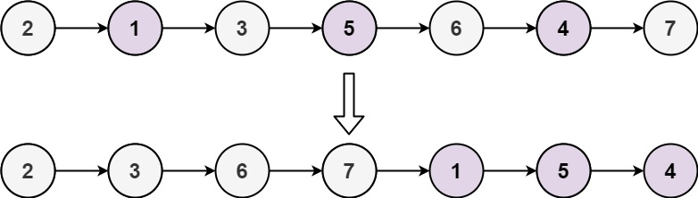

## Odd Even Linked List

Given the head of a singly linked list, group all the nodes with odd indices together followed by the nodes with even indices, and return the reordered list.

The first node is considered odd, and the second node is even, and so on.

Note that the relative order inside both the even and odd groups should remain as it was in the input.

You must solve the problem in O(1) extra space complexity and O(n) time complexity.


Input: head = [1,2,3,4,5]
Output: [1,3,5,2,4]



Input: head = [2,1,3,5,6,4,7]
Output: [2,3,6,7,1,5,4]


```python
# Definition for singly-linked list.
# class ListNode:
#     def __init__(self, val=0, next=None):
#         self.val = val
#         self.next = next
class Solution:
    def oddEvenList(self, head: Optional[ListNode]) -> Optional[ListNode]:
        arr=[]
        temp=head
        if head==None or head.next==None:
            return head
        while temp!=None and temp.next!=None:
            arr.append(temp.val)
            temp=temp.next.next
        if temp:
            arr.append(temp.val)
        temp=head.next
        while temp!=None and temp.next!=None:
            arr.append(temp.val)
            temp=temp.next.next
        if (temp):
            arr.append(temp.val)
        i=0
        temp=head
        while temp!=None:
            temp.val=arr[i]
            i+=1
            temp=temp.next
        return head
```