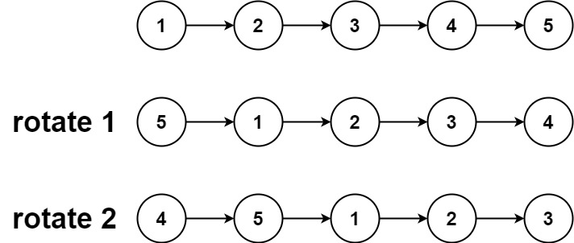
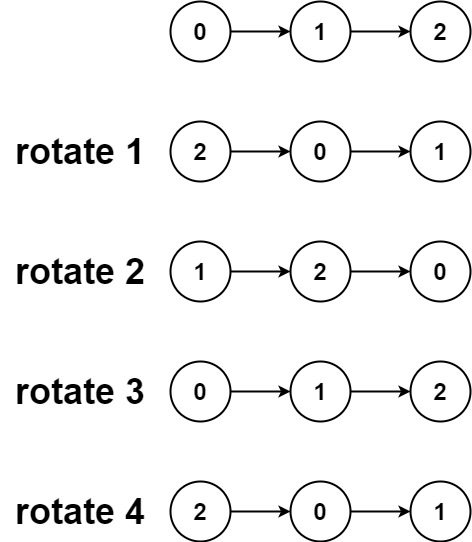

### Rotate List

- Given the head of a linked list, rotate the list to the right by k places.



Input: head = [1,2,3,4,5], k = 2
Output: [4,5,1,2,3]

Example 2:



Input: head = [0,1,2], k = 4
Output: [2,0,1]

```python
# Definition for singly-linked list.
# class ListNode:
#     def __init__(self, val=0, next=None):
#         self.val = val
#         self.next = next
class Solution:
    def NewLast(self,temp,f):
        count=1
        while temp!=None:
            if count==f:
                return temp
            count+=1
            temp=temp.next
        return temp
    def rotateRight(self, head: Optional[ListNode], k: int) -> Optional[ListNode]:
        if head==None or k==0 :
            return head
        l=1
        tail=head
        while tail.next!=None:
            l+=1
            tail=tail.next
        k=k%l

        if k==0:
            return head

        tail.next=head
        newlastNode=self.NewLast(head,l-k)
        head=newlastNode.next
        newlastNode.next=None
        return head

```