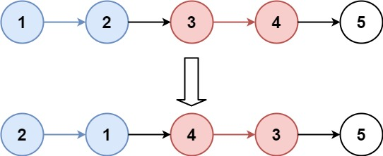
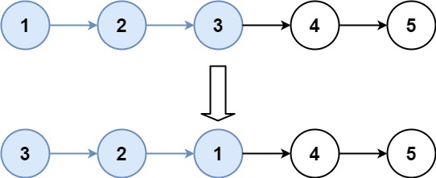

## Reverse Nodes in k-Group

Given the head of a linked list, reverse the nodes of the list k at a time, and return the modified list.

k is a positive integer and is less than or equal to the length of the linked list. If the number of nodes is not a multiple of k then left-out nodes, in the end, should remain as it is.

You may not alter the values in the list's nodes, only nodes themselves may be changed.


Example 1:



Input: head = [1,2,3,4,5], k = 2
Output: [2,1,4,3,5]

Example 2:



Input: head = [1,2,3,4,5], k = 3
Output: [3,2,1,4,5]

```python
# Definition for singly-linked list.
# class ListNode:
#     def __init__(self, val=0, next=None):
#         self.val = val
#         self.next = next
class Solution:
    def reverseKGroup(self, head: Optional[ListNode], k: int) -> Optional[ListNode]:
        dummy=ListNode(0,head)
        groupprev=dummy
        while   True:
            kth=self.getkth(groupprev,k)
            if not kth:
                break
            groupNext=kth.next
            prev=groupNext
            curr=groupprev.next
            while curr!=groupNext:
                temp=curr.next
                curr.next=prev
                prev=curr
                curr=temp
            temp=groupprev.next
            groupprev.next=kth
            groupprev=temp
        return dummy.next
    def getkth(self,curr,k):
        while curr and k>0:
            curr=curr.next
            k-=1
        return curr
```