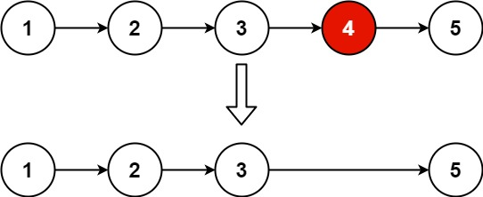

## Remove Nth Node From End of List

Given the head of a linked list, remove the nth node from the end of the list and return its head.



 Input: head = [1,2,3,4,5], n = 2
Output: [1,2,3,5]
Example 2:

Input: head = [1], n = 1
Output: []
Example 3:

Input: head = [1,2], n = 1
Output: [1]


```python

# Definition for singly-linked list.
# class ListNode:
#     def __init__(self, val=0, next=None):
#         self.val = val
#         self.next = next
class Solution:
    def removeNthFromEnd(self, head: Optional[ListNode], n: int) -> Optional[ListNode]:
        count=0
        temp=head
        while temp!=None:
            count+=1
            temp=temp.next
        if count==n:
            newhead=head.next
            return newhead
        temp=head
        res=count-n
        while temp!=None:
            res-=1
            if res==0:
                break
            temp=temp.next
        delnode=temp.next
        temp.next=temp.next.next
        return head
```