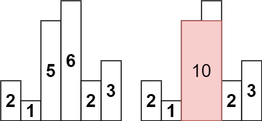
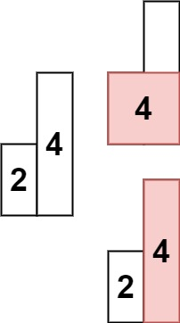

##  Largest Rectangle in Histogram

Given an array of integers heights representing the histogram's bar height where the width of each bar is 1, return the area of the largest rectangle in the histogram.

Example : 



Input: heights = [2,1,5,6,2,3]
Output: 10
Explanation: The above is a histogram where width of each bar is 1.
The largest rectangle is shown in the red area, which has an area = 10 units.

Example :



Input: heights = [2,4]
Output: 4

```python
class Solution:
    def largestRectangleArea(self, heights: list[int]) -> int:
        stack=[]
        maxi=0
        for i,h in enumerate(heights):
            start=i
            while stack and stack[-1][1]>h:
                index,height=stack.pop()
                maxi=max(maxi,height*(i-index))
                start=index
            stack.append((start,h))
        for i,h in stack:
            maxi=max(maxi,h*(len(heights)-i))
        return maxi
```