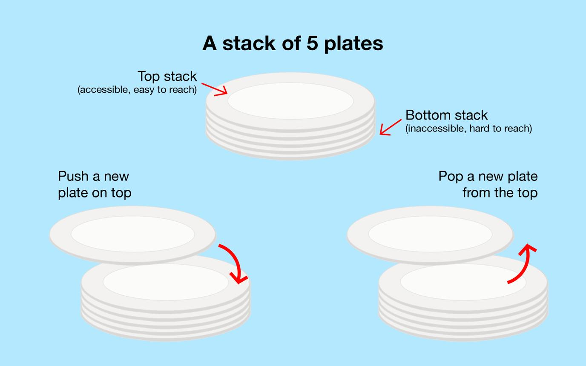
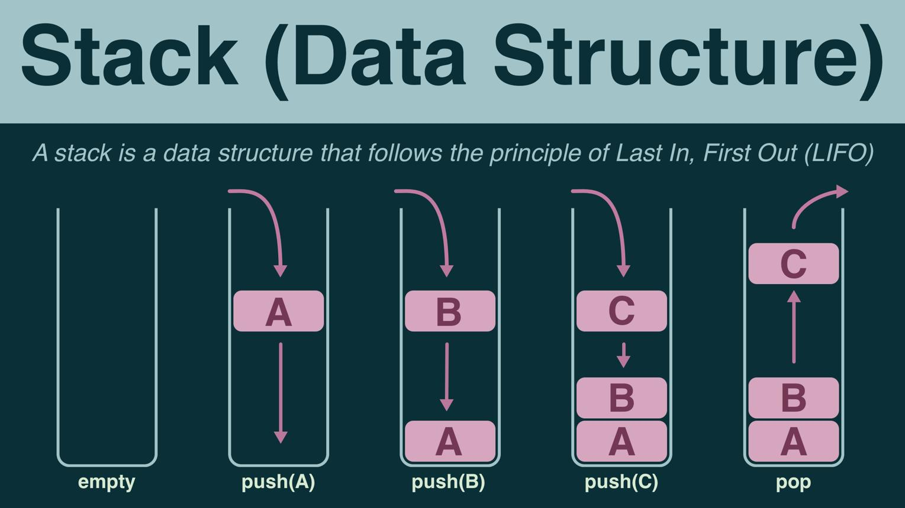
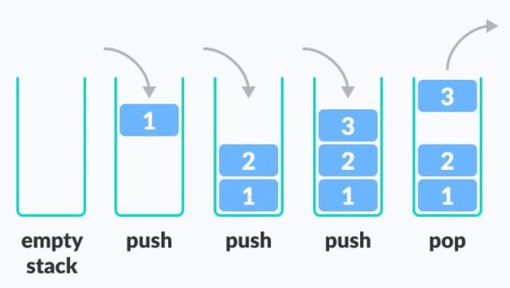
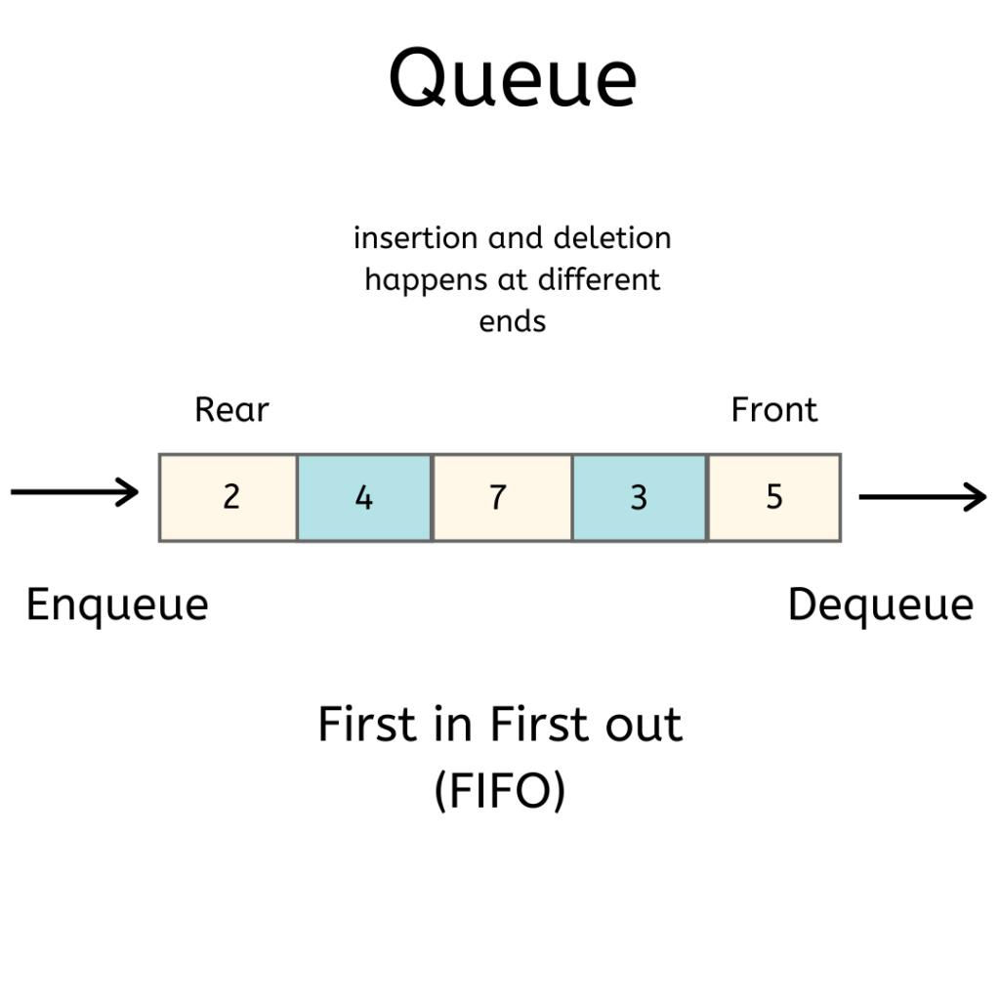
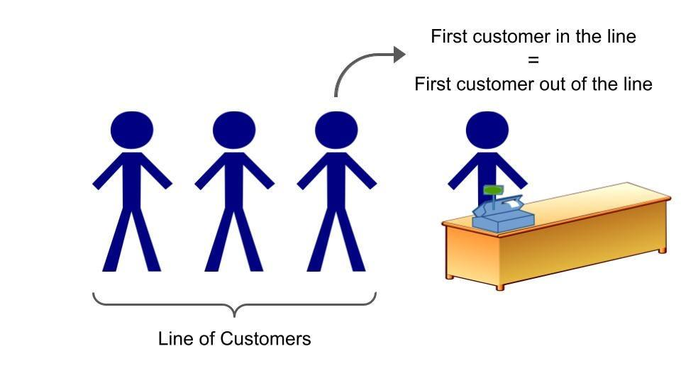
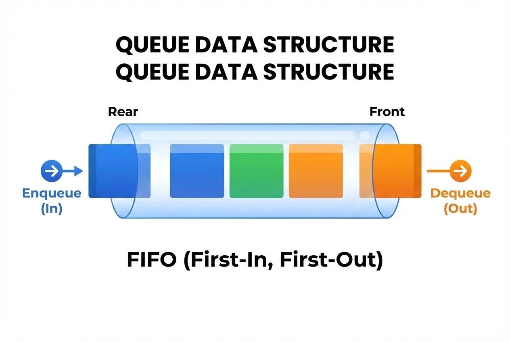

## 1. What is a Stack?


Think about a stack of plates 🍽️.







You put plates on top:

      ┌───────┐
      │ Plate │  ← Top
      ├───────┤
      │ Plate │
      ├───────┤
      │ Plate │
      └───────┘

f you want to take one out, you take the top plate first.

You can't realistically take the bottom plate without removing the plates above it.

That's exactly a Stack.

Stack follows:

LIFO = Last In, First Out

The last item inserted is the first item removed.

Example
Push 10
Push 20
Push 30

Stack becomes:

       30 ← TOP
       20
       10

Now:

Pop()

removes 30.

       20 ← TOP
       10

Another Pop():

       10 ← TOP

So:

Inserted: 10 → 20 → 30

Removed: 30 → 20 → 10
2. Main Stack Operations

There are basically three important operations.

push

Add an item.

push(10)

10

Then:

push(20)

20 ← TOP
10

Then:

push(30)

30 ← TOP
20
10
pop

Remove the top item.

pop()

Before:

30 ← TOP
20
10

After:

20 ← TOP
10

30 was removed.

peek / top

Look at the top item without removing it.

30 ← TOP
20
10
peek()

returns:

30

but 30 remains there.

3. Real-Life Examples of Stack

You actually use stacks all the time.

Browser Back button

Suppose:

Google
 ↓
YouTube
 ↓
Instagram
 ↓
GitHub

You press Back.

You go:

GitHub → Instagram

Then:

Instagram → YouTube

The most recently visited page is handled first.

Undo

Suppose you type:

A
B
C
D

Press Undo:

D removed

Again:

C removed

Again:

B removed

That's stack behavior.

Function calls

When functions call other functions, programming languages internally use a call stack.

For example:

def A():
    B()

def B():
    C()

def C():
    print("Hello")

Execution conceptually becomes:

C() ← TOP
B()
A()

C() finishes first, then B(), then A().



 

People stand like:

Front                         Rear
 ↓                              ↓

[A] [B] [C] [D]

Who came first?

A

So A gets served first.

After A leaves:

Front
 ↓
[B] [C] [D]

That's a Queue.

Queue follows:

FIFO = First In, First Out

The first item inserted is the first item removed.

5. Queue Example

Suppose:

enqueue(10)
enqueue(20)
enqueue(30)

Queue:

Front                Rear
  ↓                    ↓
[10] → [20] → [30]

Now:

dequeue()

10 leaves.

Front
 ↓
[20] → [30]

Another:

dequeue()

20 leaves.

Front
 ↓
[30]

So:

Inserted: 10 → 20 → 30

Removed: 10 → 20 → 30

Unlike Stack:

Stack: 30 → 20 → 10
Queue: 10 → 20 → 30
6. Main Queue Operations
enqueue

Add an item to the rear.

enqueue(10)

[10]
enqueue(20)

[10] → [20]
enqueue(30)

[10] → [20] → [30]
dequeue

Remove an item from the front.

[10] → [20] → [30]
 ↑
Front

After:

[20] → [30]
 ↑
Front

10 is removed.

peek

Look at the front item without removing it.

[10] → [20] → [30]
 ↑
Front

peek() gives:

10
7. Stack vs Queue

This is the part you should remember.

Feature	Stack	Queue
Principle	LIFO	FIFO
Full form	Last In First Out	First In First Out
Insert	push	enqueue
Remove	pop	dequeue
View	peek/top	peek/front
Example	Stack of plates	Line at ticket counter
Easy memory trick 🧠

Stack

Last person enters → first person leaves.

ENTER
  ↓
[10]
[20]
[30] ← leaves first

Queue

First person enters → first person leaves.

ENTER → [10] [20] [30] → EXIT
          ↑
       leaves first

```python
class Solution:
    def Stack(self):
        stack=[]
        
        while True:
            op=int(input("Enter the operation\n1. Peek\n2. push()\n3. pop()\n4. exit\n"))
            match(op):
                case 1:
                    if len(stack)<1:
                        print("Stack has no elements")
                    else:
                        print( stack[-1])
                case 2:
                    noOfEl=int(input("Enter the how many numbers to push : "))
                    for i in range(noOfEl):
                        data=int(input("Enter the element : "))
                        stack.append(data)
                    print(stack)
                case 3:
                    print(stack.pop() + "Removed")
                case 4 :
                    op=0
                    print("Bye!")
print(Solution().Stack())
```